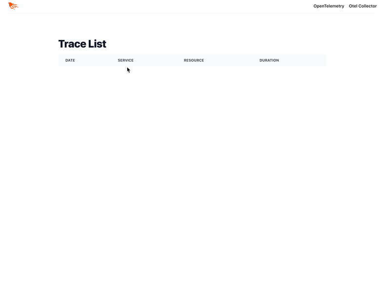

# Latch

Latch allows viewing OpenTelemetry data as it is coming in, as well as a time-limited
amount of recent data.

Many OpenTelemetry products are closed-source SaaS. This can be prohibitive for some
due to cost or PII-data. Latch has no dependencies and receives OpenTelemetry data
directly. This allows for easy setup. It can also be combined with an existing SaaS
product, where PII-data is scrubbed from the SaaS data and retained for a short
period in Latch.



## Getting traces
If you do not have any software that generates OpenTelemetry,
the sample application inside `example-sender/` can be used.
Please see the README there.

Currently, Latch only accepts traces over HTTP in the otlp-proto format.


## Future work
- Allow connecting to [Clickhouse](https://github.com/open-telemetry/opentelemetry-collector-contrib/blob/main/exporter/clickhouseexporter/exporter_traces.go#L161-L198) to support loading historic traces
- Improve ingestion performance
- Allow filtering traces

## Development

Generate Protox protobuf messages:
```
MIX_ENV=prod mix protox.generate --keep-unknown-fields=false --generate-defs-funs=false --output-path=trace.ex --include-path=/Users/hans.krutzer/Development/opensource/opentelemetry-proto /Users/hans.krutzer/Development/opensource/opentelemetry-proto/opentelemetry/proto/collector/trace/v1/trace_service.protobuf
```

